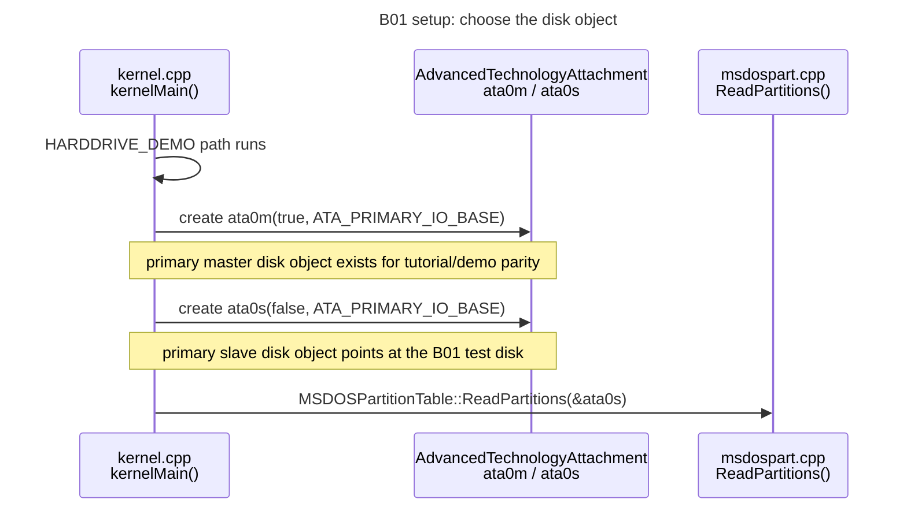
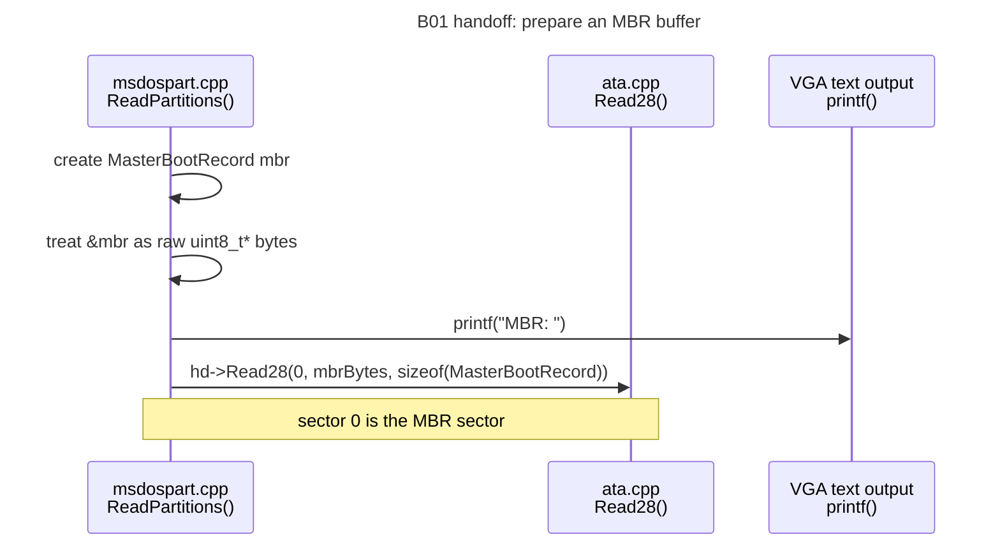
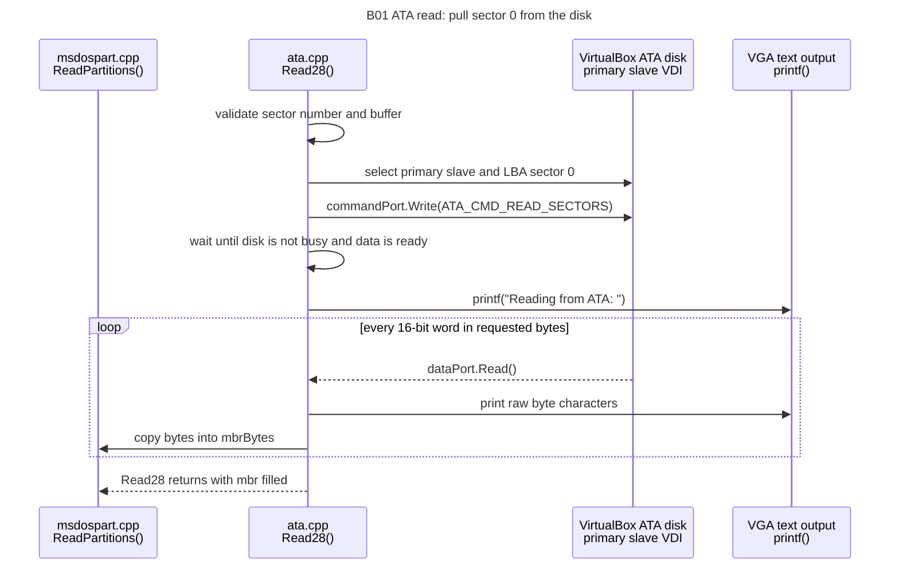
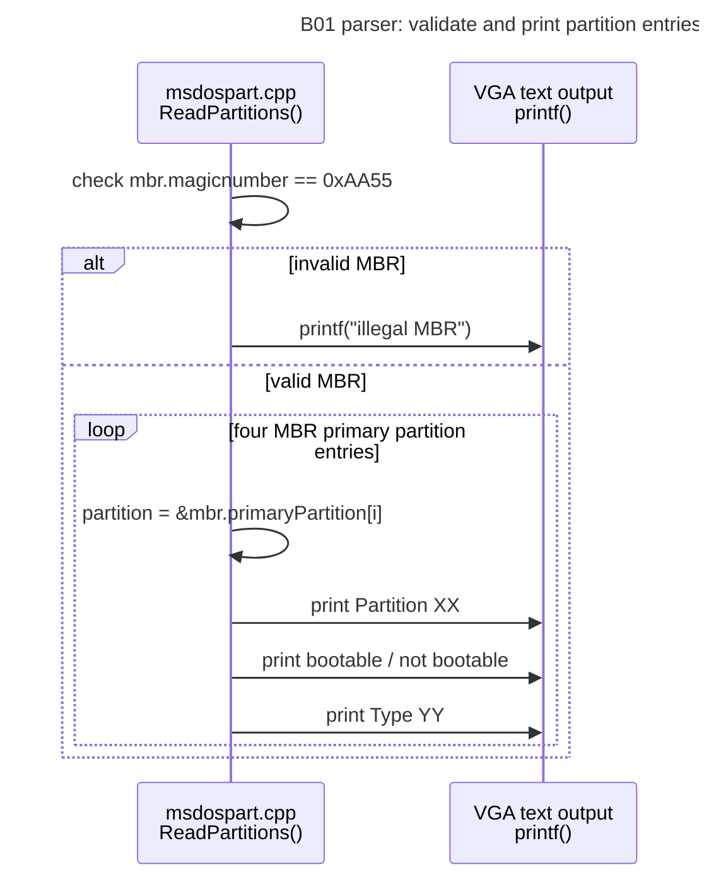
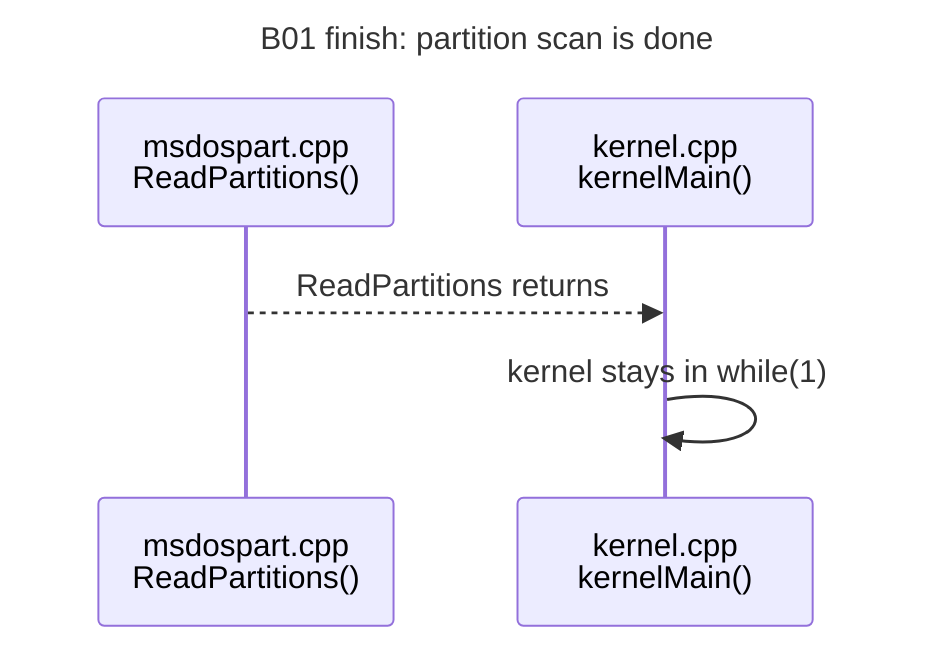

# B01 MS-DOS Partition Table Timeline

This is the same B01 demo split into smaller diagrams so each step stays readable without deep zoom.

## 1. Kernel Disk Setup

## 2. Partition Reader Requests Sector 0

## 3. ATA Reads The MBR Bytes

## 4. MBR Magic Check And Partition Output

## 5. Return To The Kernel

## Function Order

1. `kernelMain()` in `src/kernel.cpp`
2. `AdvancedTechnologyAttachment::AdvancedTechnologyAttachment(...)` in `src/drivers/ata.cpp`
3. `MSDOSPartitionTable::ReadPartitions(...)` in `src/filesystem/msdospart.cpp`
4. `AdvancedTechnologyAttachment::Read28(...)` in `src/drivers/ata.cpp`
5. `Port8Bit::Write(...)` / `Port16Bit::Read(...)` through the ATA ports
6. back to `ReadPartitions(...)` to parse `mbr.primaryPartition[0..3]`

## What Each Piece Means

`ata0m` is the primary master disk object.

`ata0s` is the primary slave disk object. The B01 test disk is attached here, so this is the disk passed to `ReadPartitions()`.

`Read28(0, ...)` reads sector `0`. On an MBR-partitioned disk, sector `0` contains the Master Boot Record.

`MasterBootRecord` is the struct layout used to interpret the 512 bytes from sector `0`.

`primaryPartition[4]` is the four-entry MS-DOS/MBR partition table.

The raw weird characters come from `Read28()` printing the MBR bytes as text before `ReadPartitions()` prints the same bytes in a structured way.
