# B01 Block Flow Chart: Tiny Core Disk Prep To MyOS MBR Read

```mermaid
%%{init: {"theme": "base", "themeVariables": {"background": "#f8fafc", "mainBkg": "#ffffff", "primaryBorderColor": "#334155", "lineColor": "#64748b", "fontFamily": "Inter, ui-sans-serif, system-ui, sans-serif"}}}%%
flowchart TD
    subgraph S1["Setup"]
        A["START STATE<br/><br/>Extra VirtualBox hard disk<br/>attached as ATA primary slave<br/><br/>Tiny Core sees whole disk as /dev/hdb"]
    end

    subgraph S2["Tiny Core disk preparation"]
        B["FDISK MAKES PARTITIONS<br/><br/>sudo fdisk /dev/hdb<br/><br/>Creates partition entries<br/>Writes MBR partition table into sector 0"]

        C["DISK AFTER FDISK<br/><br/>/dev/hdb = whole disk<br/>/dev/hdb1 = partition 1 region<br/>/dev/hdb2 = partition 2 region<br/><br/>No FAT32 filesystems yet"]

        D["INSTALL FAT TOOLS<br/><br/>tce-load -wi dosfstools<br/><br/>Provides mkfs.vfat and mkdosfs"]

        E["MKFS MAKES FAT32 FILESYSTEMS<br/><br/>sudo mkfs.vfat -F 32 /dev/hdb1<br/>sudo mkfs.vfat -F 32 /dev/hdb2<br/><br/>Writes FAT32 structures inside each partition"]

        F["DISK AFTER FORMAT<br/><br/>sector 0 = MBR partition table<br/>hdb1 = FAT32 filesystem<br/>hdb2 = FAT32 filesystem"]

        G["TINY CORE CREATES TEST FILES<br/><br/>Mount /dev/hdb1 and /dev/hdb2<br/>Create FILE1 and FILE2 in each partition<br/><br/>These files are what B02 reads later"]
    end

    subgraph S3["MyOS reads what Tiny Core created"]
        H["MYOS B01 DEMO STARTS<br/><br/>kernel.cpp creates ata0s<br/>ata0s points at the same primary slave disk"]

        I["MYOS READS SECTOR 0<br/><br/>MSDOSPartitionTable::ReadPartitions(&ata0s)<br/>hd->Read28(0, mbrBytes, sizeof(MasterBootRecord))<br/><br/>Reads the MBR that fdisk wrote"]

        J["MYOS PARSES MBR<br/><br/>Checks 0xAA55<br/>Reads primaryPartition[0..3]<br/>Prints bootable flag and partition type<br/>Learns start_lba offsets for FAT32 later"]
    end

    A --> B --> C --> D --> E --> F --> G --> H --> I --> J

    classDef start fill:#eef2ff,stroke:#4f46e5,stroke-width:2px,color:#111827
    classDef tinycore fill:#ecfeff,stroke:#0891b2,stroke-width:2px,color:#111827
    classDef disk fill:#fef3c7,stroke:#d97706,stroke-width:2px,color:#111827
    classDef myos fill:#dcfce7,stroke:#16a34a,stroke-width:2px,color:#111827
    classDef final fill:#fce7f3,stroke:#db2777,stroke-width:2px,color:#111827
    classDef setupZone fill:#eef2ff,stroke:#818cf8,stroke-width:2px,color:#312e81
    classDef tinycoreZone fill:#f0fdfa,stroke:#14b8a6,stroke-width:2px,color:#134e4a
    classDef myosZone fill:#f0fdf4,stroke:#22c55e,stroke-width:2px,color:#14532d

    class A start
    class B,D,E,G tinycore
    class C,F disk
    class H,I myos
    class J final
    class S1 setupZone
    class S2 tinycoreZone
    class S3 myosZone

    linkStyle 0 stroke:#4f46e5,stroke-width:3px
    linkStyle 1 stroke:#d97706,stroke-width:3px
    linkStyle 2 stroke:#0891b2,stroke-width:3px
    linkStyle 3 stroke:#0891b2,stroke-width:3px
    linkStyle 4 stroke:#d97706,stroke-width:3px
    linkStyle 5 stroke:#0891b2,stroke-width:3px
    linkStyle 6 stroke:#16a34a,stroke-width:3px
    linkStyle 7 stroke:#16a34a,stroke-width:3px
    linkStyle 8 stroke:#db2777,stroke-width:3px
```



## Three Separate Jobs

```text
1. fdisk = make partitions
2. mkfs.vfat / dosfstools = make FAT32 filesystems inside those partitions
3. MyOS code = read the partition table
```

## Tiny Core Test Files

After the FAT32 filesystems exist, Tiny Core can mount the partitions and create the small demo files:

```sh
sudo mkdir -p /mnt/hdb1
sudo mkdir -p /mnt/hdb2

sudo mount /dev/hdb1 /mnt/hdb1
sudo mount /dev/hdb2 /mnt/hdb2

echo "this is partition 1, file 1" | sudo tee /mnt/hdb1/FILE1
echo "this is partition 1, file 2" | sudo tee /mnt/hdb1/FILE2

echo "this is partition 2, file 1" | sudo tee /mnt/hdb2/FILE1
echo "this is partition 2, file 2" | sudo tee /mnt/hdb2/FILE2

sync
sudo umount /mnt/hdb1
sudo umount /mnt/hdb2
```

B01 only reads the partition table. These files become visible to MyOS in B02, after the FAT32 directory-reading code exists.
