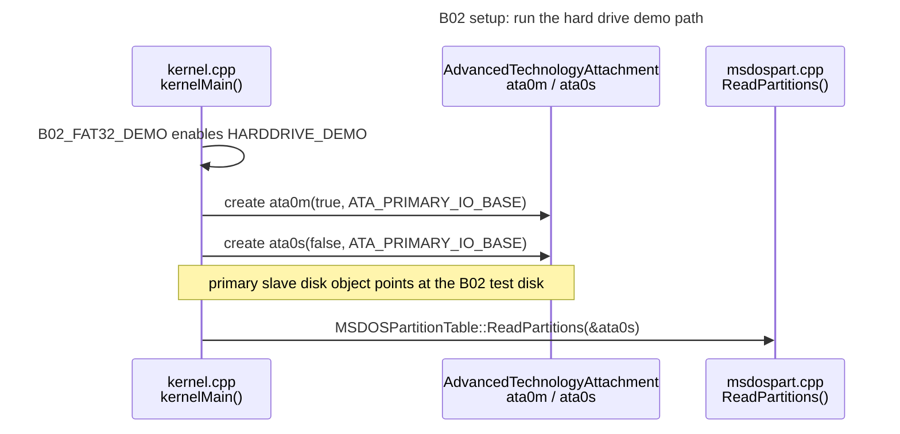
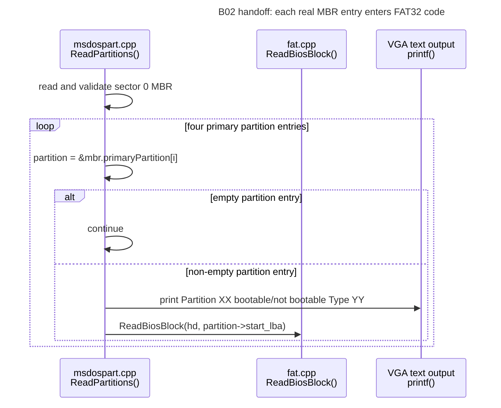
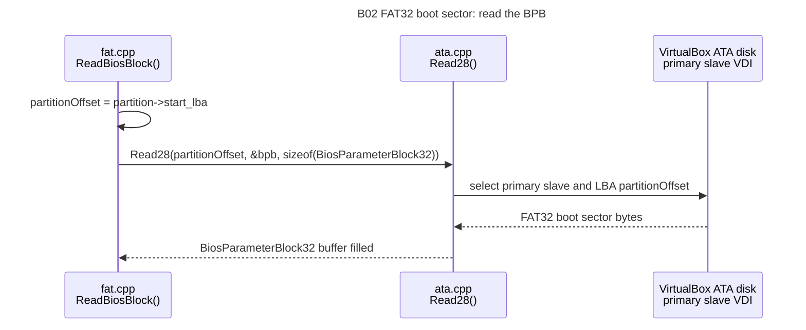
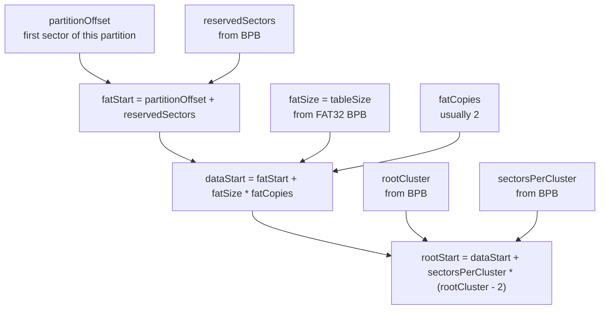
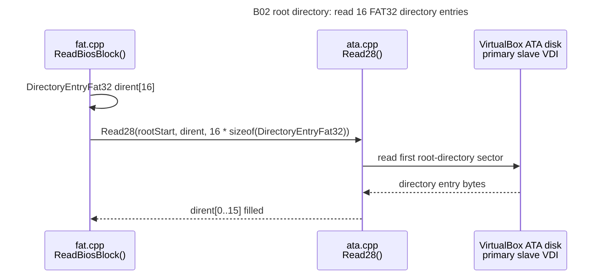
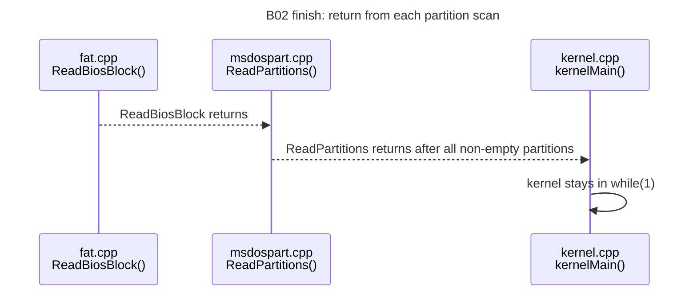

# B02 FAT32 Directory And Small File Timeline

This is the same B02 demo split into smaller diagrams so each step stays readable without deep zoom.

B01 and B02 should stay separate. B01 answers "where do the partitions start?" B02 reuses that answer, then reads the FAT32 boot sector, root directory, and first sector of each tiny file.

## 1. Kernel Reuses The B01 Entry Point



## 2. B01 Partition Scan Becomes The B02 Handoff



## 3. FAT32 Boot Sector Read



## 4. FAT32 Layout Math



## 5. Root Directory Sector Read



## 6. Directory Entry Loop

```mermaid
sequenceDiagram
    title B02 directory parser: names, directories, and files

    participant FAT as fat.cpp<br/>ReadBiosBlock()
    participant ATA as ata.cpp<br/>Read28()
    participant Disk as VirtualBox ATA disk<br/>primary slave VDI
    participant Screen as VGA text output<br/>printf()

    loop dirent[0] through dirent[15]
        FAT->>FAT: inspect dirent[i].name[0] and attributes
        alt name[0] == 0x00
            FAT->>FAT: break; no more used entries in this sector
        else long-file-name helper entry
            FAT->>FAT: continue
        else normal 8.3 entry
            FAT->>Screen: print 8-byte name field
            alt directory attribute is set
                FAT->>FAT: continue; B02 does not recurse
            else file entry
                FAT->>FAT: fileCluster = firstClusterHi:firstClusterLow
                FAT->>FAT: fileSector = dataStart + sectorsPerCluster * (fileCluster - 2)
                FAT->>ATA: Read28(fileSector, buffer, 512)
                ATA->>Disk: read first file data sector
                Disk-->>ATA: file bytes
                ATA-->>FAT: buffer filled
                FAT->>FAT: add null terminator at min(file size, 512)
                FAT->>Screen: print file contents
            end
        end
    end
```

## 7. Return Path



## Function Order

1. `kernelMain()` in `src/kernel.cpp`
2. `MSDOSPartitionTable::ReadPartitions(...)` in `src/filesystem/msdospart.cpp`
3. `ReadBiosBlock(...)` in `src/filesystem/fat.cpp` for each non-empty partition
4. `AdvancedTechnologyAttachment::Read28(...)` for the FAT32 boot sector
5. BPB / EBPB parsing and cluster-to-sector math
6. `AdvancedTechnologyAttachment::Read28(...)` for the root directory sector
7. 32-byte FAT directory entry parsing
8. `AdvancedTechnologyAttachment::Read28(...)` for each tiny file's first data sector

## What Each Piece Means

`partitionStartLBA` is the first disk sector of the FAT32 partition. B01 gets this from the MBR partition entry.

In the current code, `partitionStartLBA` is passed to `ReadBiosBlock()` as `partitionOffset`.

`BPB_BytsPerSec` is the sector size stored by the formatter, usually `512`.

`BPB_SecPerClus` tells how many sectors make one FAT32 cluster.

`BPB_RsvdSecCnt` tells how many sectors come before the first FAT.

`BPB_NumFATs` and `BPB_FATSz32` describe the FAT area. B02 can use these to skip past the FATs and find the data area.

`BPB_RootClus` gives the first cluster of the root directory. In FAT32, the root directory is a normal cluster chain in the data area, not a fixed table like FAT12/FAT16.

Each directory entry is `32` bytes. B02 reads 16 entries, cares about normal short-name entries, skips long-file-name helper entries, and stops when it sees an empty entry.

The file's first cluster points to the first data sector for that file. B02 reads that first sector directly, null-terminates the buffer at the smaller of file size and 512 bytes, then prints it. Following the FAT chain is B03 territory.
