# B02 Block Flow Chart: MyOS FAT32 Directory And File Read

```mermaid
%%{init: {"theme": "base", "themeVariables": {"background": "#f8fafc", "mainBkg": "#ffffff", "primaryBorderColor": "#334155", "lineColor": "#64748b", "fontFamily": "Inter, ui-sans-serif, system-ui, sans-serif"}}}%%
flowchart TD
    subgraph S1["Setup"]
        A["START STATE<br/><br/>Extra VirtualBox hard disk<br/>attached as ATA primary slave<br/><br/>Disk already has the B01 MBR partition table"]
    end

    subgraph S2["Tiny Core disk preparation"]
        B["PARTITIONS EXIST<br/><br/>/dev/hdb = whole disk<br/>/dev/hdb1 = partition 1 region<br/>/dev/hdb2 = partition 2 region<br/><br/>MBR partition types still show as 83"]

        C["FAT32 FILESYSTEMS EXIST<br/><br/>tce-load -wi dosfstools<br/>sudo mkfs.vfat -F 32 /dev/hdb1<br/>sudo mkfs.vfat -F 32 /dev/hdb2<br/><br/>Each partition now has a FAT32 boot sector, FAT area, data area, and root directory"]

        D["TEST FILES EXIST<br/><br/>Mount /dev/hdb1 and /dev/hdb2<br/>Create FILE1 and FILE2 in each partition<br/><br/>The root directory has 32-byte entries pointing to file clusters"]
    end

    subgraph S3["MyOS reads what Tiny Core created"]
        E["MYOS B02 DEMO STARTS<br/><br/>kernel.cpp creates ata0s<br/>ata0s points at the same primary slave disk<br/><br/>MSDOSPartitionTable::ReadPartitions(&ata0s)"]

        F["MYOS READS SECTOR 0<br/><br/>hd->Read28(0, mbrBytes, sizeof(MasterBootRecord))<br/><br/>Reads the MBR and prints each non-empty partition entry"]

        G["MYOS ENTERS EACH PARTITION<br/><br/>For partition 00 and partition 01<br/><br/>ReadBiosBlock(hd, partition->start_lba)<br/><br/>partition->start_lba is the first sector of that FAT32 filesystem"]

        H["MYOS READS FAT32 BIOS BLOCK<br/><br/>hd->Read28(partitionOffset, &bpb, sizeof(BiosParameterBlock32))<br/><br/>Learns reservedSectors, tableSize, fatCopies, sectorsPerCluster, and rootCluster"]

        I["MYOS COMPUTES ROOT DIRECTORY<br/><br/>fatStart = partitionOffset + reservedSectors<br/>dataStart = fatStart + tableSize * fatCopies<br/>rootStart = dataStart + sectorsPerCluster * (rootCluster - 2)"]

        J["MYOS READS ROOT DIRECTORY<br/><br/>DirectoryEntryFat32 dirent[16]<br/>hd->Read28(rootStart, dirent, 16 * sizeof(DirectoryEntryFat32))<br/><br/>Loops through short 8.3 directory entries"]

        K["MYOS PRINTS FILE NAMES<br/><br/>Skips empty entries<br/>Skips long-file-name helper entries<br/>Prints the 8-byte FAT name field<br/><br/>FILE1 and FILE2 appear on screen"]

        L["MYOS READS FILE CONTENTS<br/><br/>fileCluster = firstClusterHi:firstClusterLow<br/>fileSector = dataStart + sectorsPerCluster * (fileCluster - 2)<br/>hd->Read28(fileSector, buffer, 512)<br/><br/>Prints this is partition X, file Y"]
    end

    A --> B --> C --> D --> E --> F --> G --> H --> I --> J --> K --> L

    classDef start fill:#eef2ff,stroke:#4f46e5,stroke-width:2px,color:#111827
    classDef tinycore fill:#ecfeff,stroke:#0891b2,stroke-width:2px,color:#111827
    classDef disk fill:#fef3c7,stroke:#d97706,stroke-width:2px,color:#111827
    classDef myos fill:#dcfce7,stroke:#16a34a,stroke-width:2px,color:#111827
    classDef final fill:#fce7f3,stroke:#db2777,stroke-width:2px,color:#111827
    classDef setupZone fill:#eef2ff,stroke:#818cf8,stroke-width:2px,color:#312e81
    classDef tinycoreZone fill:#f0fdfa,stroke:#14b8a6,stroke-width:2px,color:#134e4a
    classDef myosZone fill:#f0fdf4,stroke:#22c55e,stroke-width:2px,color:#14532d

    class A start
    class B,C,D tinycore
    class F,H,J disk
    class E,G,I,K myos
    class L final
    class S1 setupZone
    class S2 tinycoreZone
    class S3 myosZone

    linkStyle 0 stroke:#4f46e5,stroke-width:3px
    linkStyle 1 stroke:#0891b2,stroke-width:3px
    linkStyle 2 stroke:#0891b2,stroke-width:3px
    linkStyle 3 stroke:#16a34a,stroke-width:3px
    linkStyle 4 stroke:#16a34a,stroke-width:3px
    linkStyle 5 stroke:#16a34a,stroke-width:3px
    linkStyle 6 stroke:#16a34a,stroke-width:3px
    linkStyle 7 stroke:#d97706,stroke-width:3px
    linkStyle 8 stroke:#d97706,stroke-width:3px
    linkStyle 9 stroke:#16a34a,stroke-width:3px
    linkStyle 10 stroke:#db2777,stroke-width:3px
```



## Five Separate Jobs

```text
1. fdisk / MBR = remember where each partition starts
2. mkfs.vfat = create FAT32 metadata inside each partition
3. MyOS partition code = read sector 0 and get partition->start_lba
4. MyOS FAT32 code = read the BPB and compute rootStart / dataStart
5. MyOS directory code = print FILE1 / FILE2 and read their first data sector
```

## Tiny Core Commands

After B01 has created the two partitions, Tiny Core prepares the FAT32 filesystems and demo files:

```sh
tce-load -wi dosfstools

sudo mkfs.vfat -F 32 /dev/hdb1
sudo mkfs.vfat -F 32 /dev/hdb2

sudo mkdir -p /mnt/hdb1
sudo mkdir -p /mnt/hdb2

sudo mount /dev/hdb1 /mnt/hdb1
sudo mount /dev/hdb2 /mnt/hdb2

echo "this is partition 1, file 1" | sudo tee /mnt/hdb1/FILE1
echo "this is partition 1, file 2" | sudo tee /mnt/hdb1/FILE2

echo "this is partition 2, file 1" | sudo tee /mnt/hdb2/FILE1
echo "this is partition 2, file 2" | sudo tee /mnt/hdb2/FILE2

sync
sudo umount /mnt/hdb1
sudo umount /mnt/hdb2
```

## Screen Output Meaning

```text
MBR: Reading from ATA:
```

MyOS is reading sector 0 from the primary slave disk.

```text
Partition 00 not bootable. Type 83
```

MyOS parsed one MBR partition entry. The `83` is the partition table type byte; the filesystem inside the partition is still FAT32 because Tiny Core formatted it with `mkfs.vfat`.

```text
FILE1
Reading from ATA: this is partition 1, file 1
```

MyOS parsed a FAT32 root-directory entry named `FILE1`, found the file's first cluster, read that cluster's sector, and printed the file contents.
