# UDP, TCP, and HTTP Server Diagram

This is an editable Mermaid diagram set for the UDP/TCP pieces and the small HTTP demo server wired up in `src/kernel.cpp`.

Focused timeline versions:

- `docs/net-stack-timeline-all-in-one.md`: one large continuous timeline
- `docs/net-stack-timeline-7-part.md`: the same flow split into seven smaller diagrams

## Network Stack Timeline

The timeline is split into smaller slices so each piece stays readable without deep zoom.

### Startup Wiring

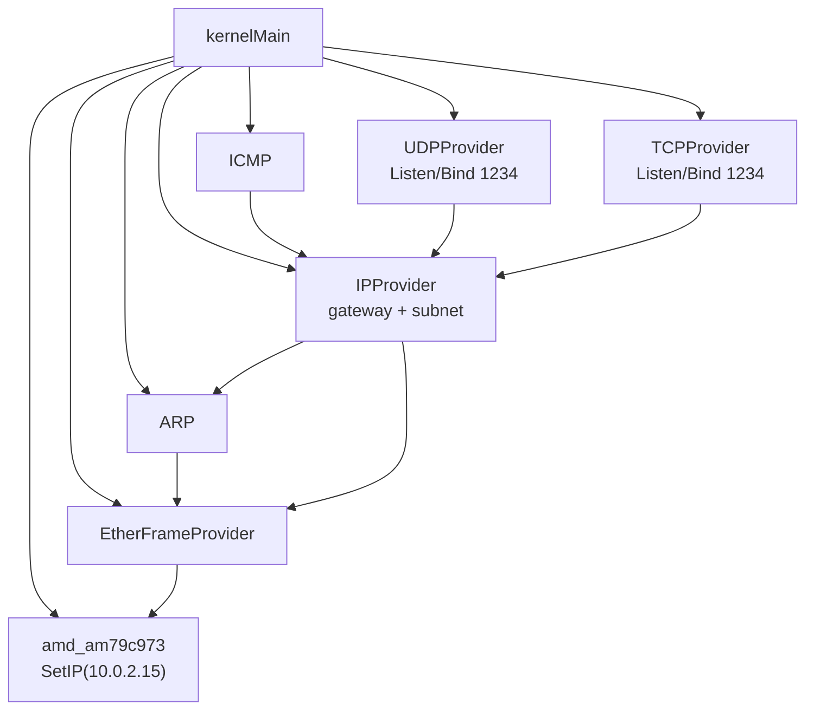

### Gateway ARP Bootstrap

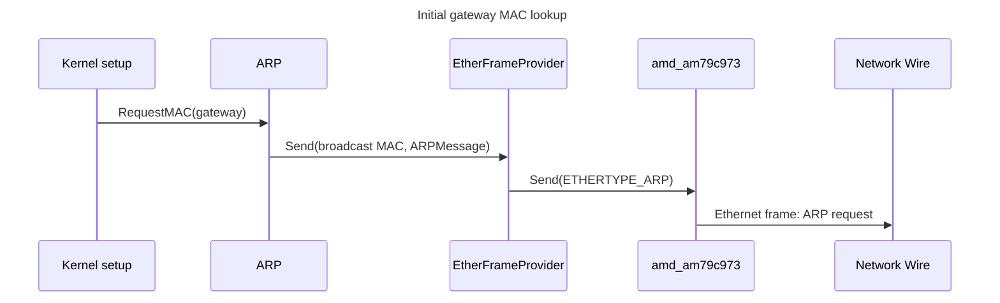

### Receive Entry

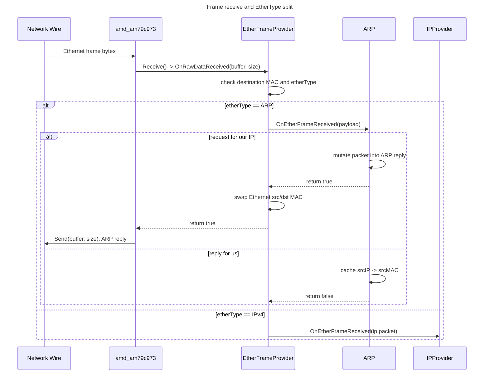

### IPv4 Handler Dispatch

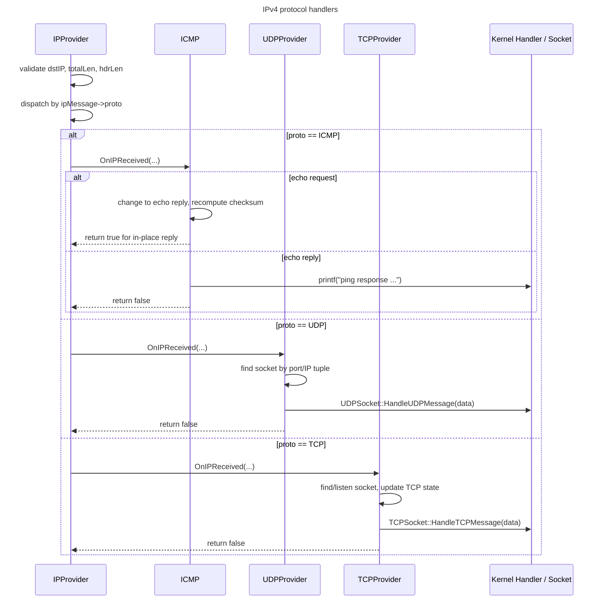

### In-Place Reply Path

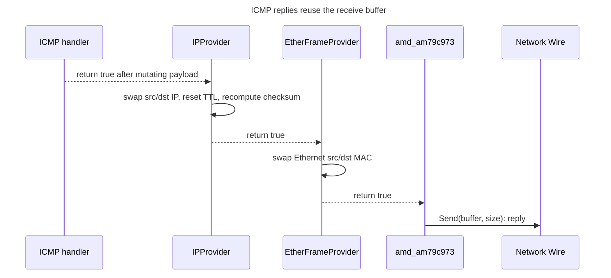

### TCP Generated Response

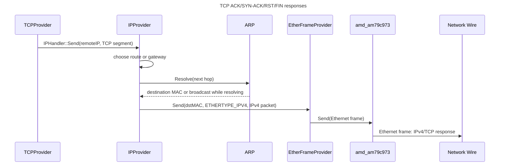

### App Send Path

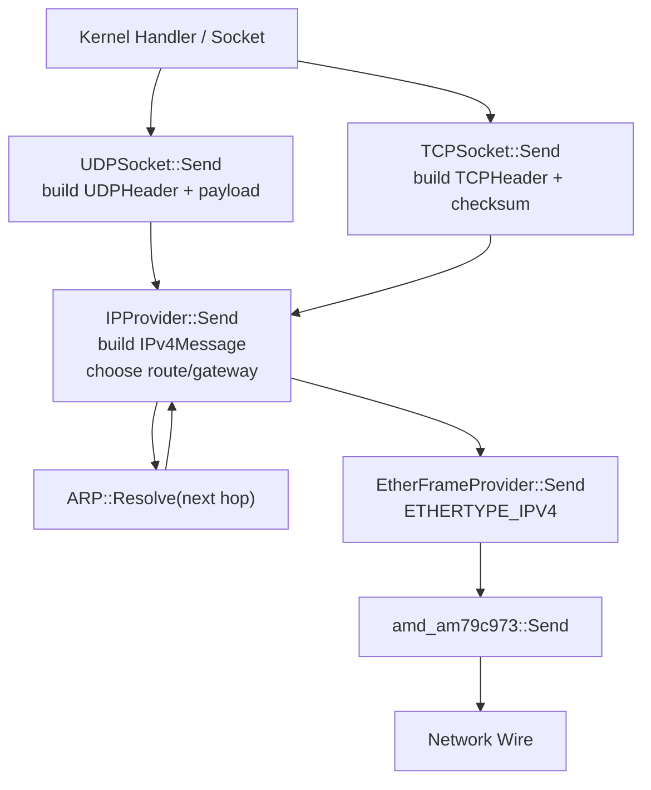

## Structs, Classes, and Ownership

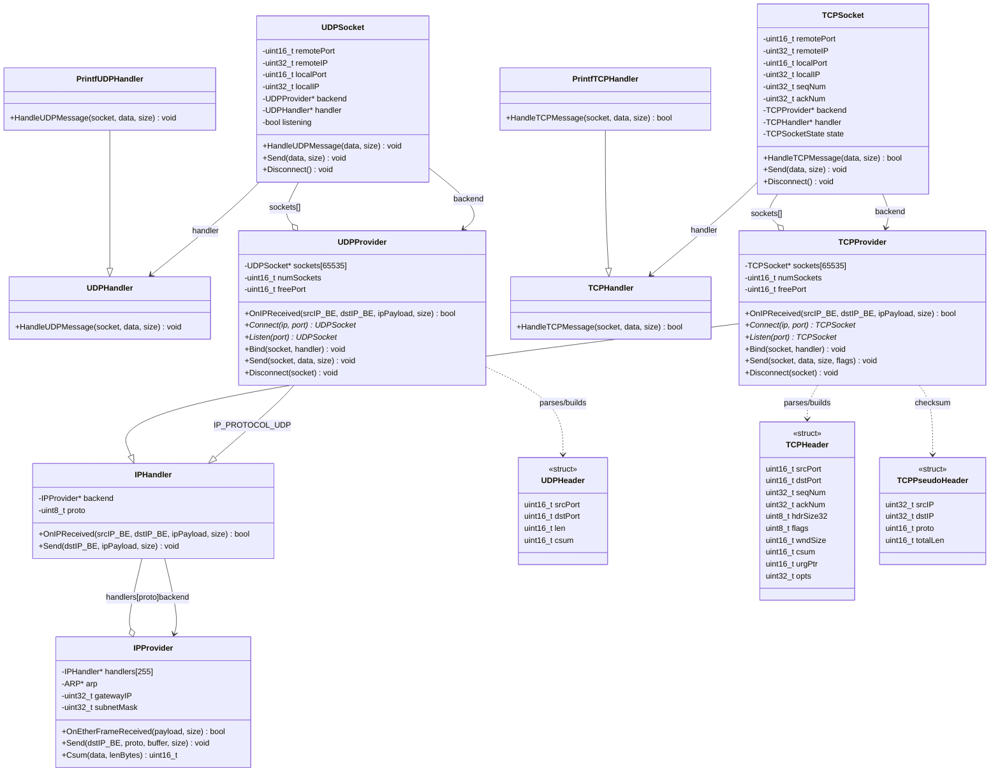

## Runtime Wiring

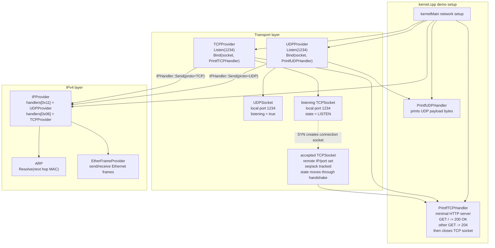

## Incoming UDP Flow

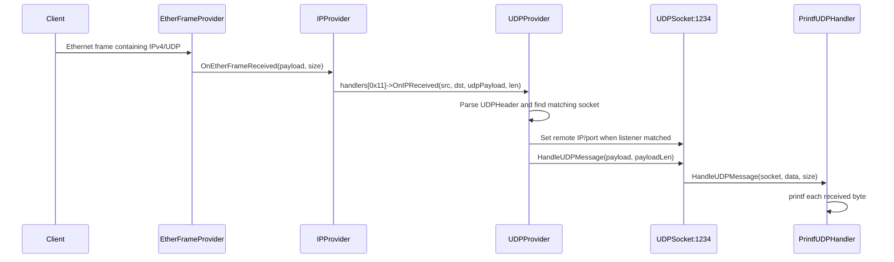

## Incoming TCP / HTTP Flow

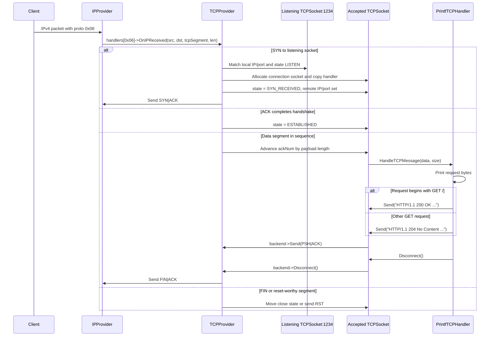

## Key Source Locations

- `include/net/udp.h`: `UDPHeader`, `UDPHandler`, `UDPSocket`, `UDPProvider`
- `src/net/udp.cpp`: UDP receive dispatch, listen/connect/bind/send/disconnect behavior
- `include/net/tcp.h`: `TCPHeader`, `TCPPseudoHeader`, `TCPHandler`, `TCPSocket`, `TCPProvider`, TCP flags/states
- `src/net/tcp.cpp`: TCP state handling, accepted socket allocation, ACK/FIN/RST behavior, packet send/checksum behavior
- `src/kernel.cpp`: `PrintfUDPHandler`, `PrintfTCPHandler`, and port `1234` setup for both UDP printing and TCP HTTP responses
