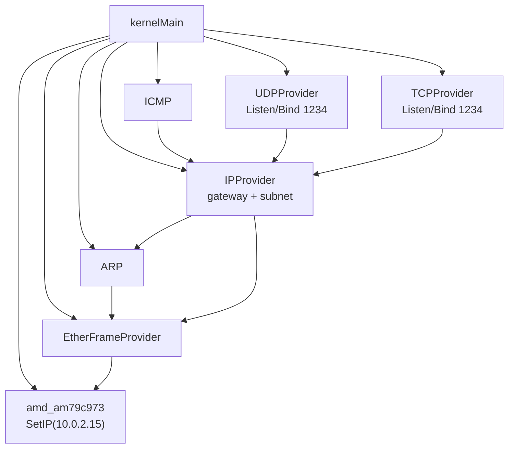
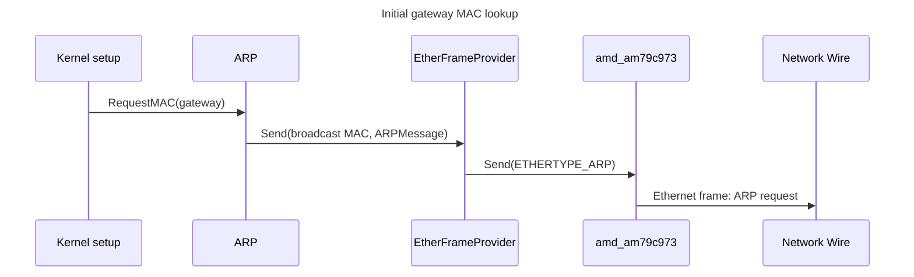
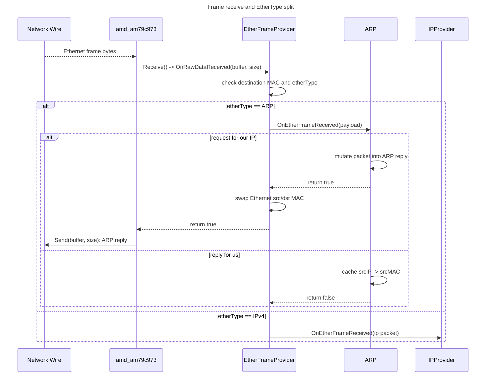
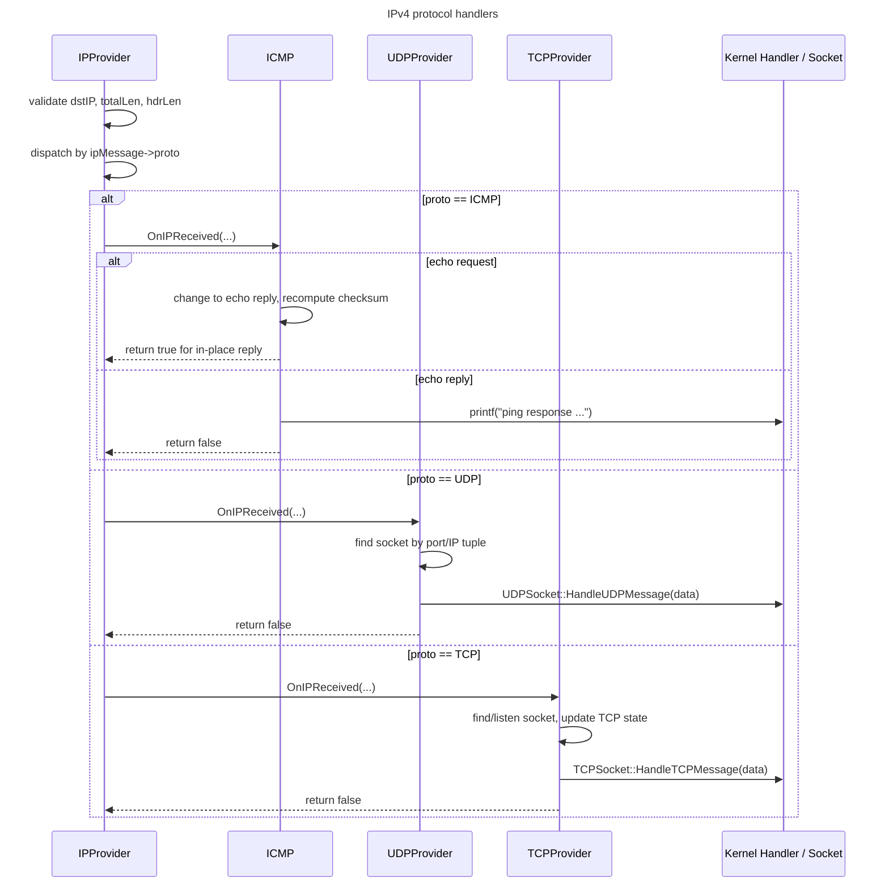
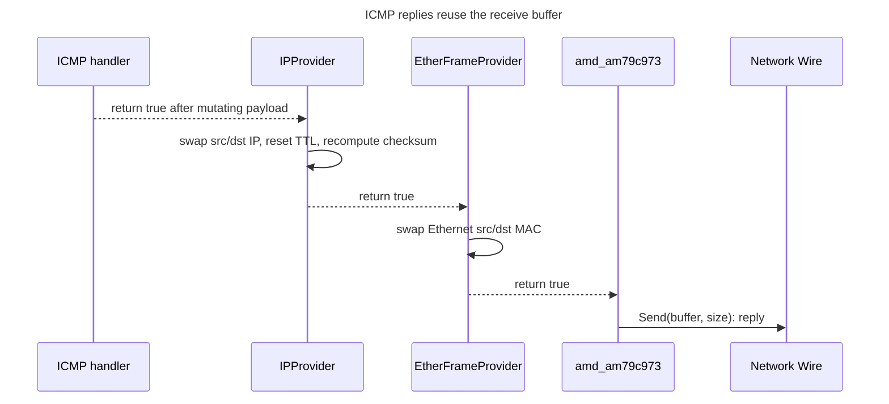
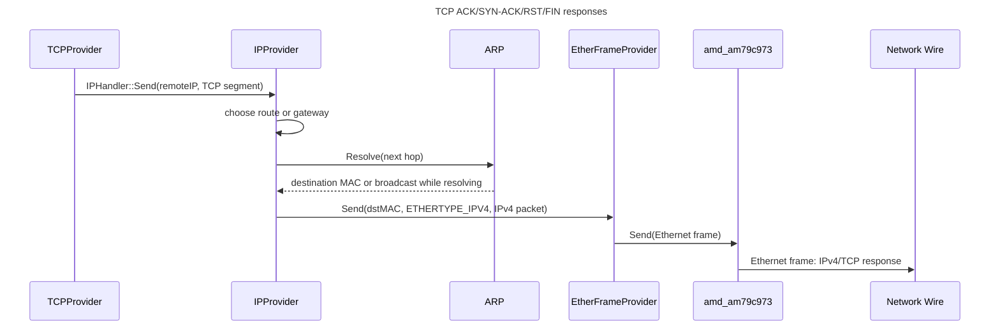
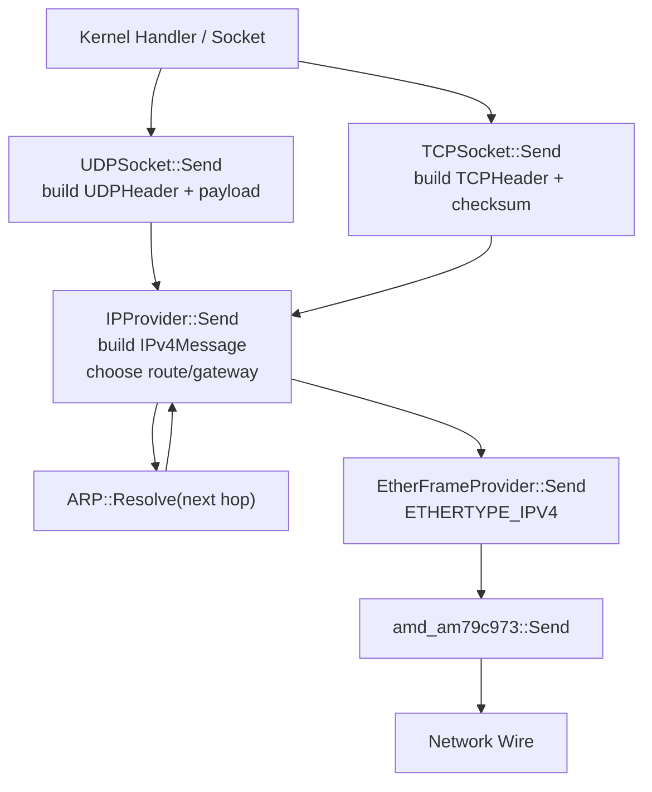

# Network Stack Timeline: Seven Part View

This is the same network stack flow split into smaller diagrams so each piece stays readable without deep zoom.

## 1. Startup Wiring

## 2. Gateway ARP Bootstrap

## 3. Receive Entry

## 4. IPv4 Handler Dispatch

## 5. In-Place Reply Path

## 6. TCP Generated Response

## 7. App Send Path

