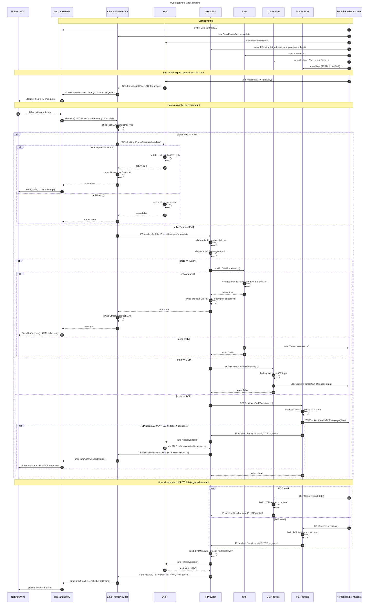

# Network Stack Timeline: All In One

This is the single large Mermaid timeline for seeing the whole packet path in one continuous view.

```mermaid
sequenceDiagram
    autonumber
    title myos Network Stack Timeline

    participant Wire as Network Wire
    participant NIC as amd_am79c973
    participant EF as EtherFrameProvider
    participant ARP as ARP
    participant IP as IPProvider
    participant ICMP as ICMP
    participant UDP as UDPProvider
    participant TCP as TCPProvider
    participant App as Kernel Handler / Socket

    Note over App,NIC: Startup wiring
    App->>NIC: eth0->SetIP(10.0.2.15)
    App->>EF: new EtherFrameProvider(eth0)
    App->>ARP: new ARP(etherframe)
    App->>IP: new IPProvider(etherframe, arp, gateway, subnet)
    App->>ICMP: new ICMP(ipv4)
    App->>UDP: udp->Listen(1234), udp->Bind(...)
    App->>TCP: tcp->Listen(1234), tcp->Bind(...)

    Note over App,Wire: Initial ARP request goes down the stack
    App->>ARP: arp->RequestMAC(gateway)
    ARP->>EF: Send(broadcast MAC, ARPMessage)
    EF->>NIC: EtherFrameProvider::Send(ETHERTYPE_ARP)
    NIC->>Wire: Ethernet frame: ARP request

    Note over Wire,App: Incoming packet travels upward
    Wire-->>NIC: Ethernet frame bytes
    NIC->>EF: Receive() -> OnRawDataReceived(buffer, size)
    EF->>EF: check dst MAC and etherType

    alt etherType == ARP
        EF->>ARP: ARP::OnEtherFrameReceived(payload)

        alt ARP request for our IP
            ARP->>ARP: mutate packet into ARP reply
            ARP-->>EF: return true
            EF->>EF: swap Ethernet src/dst MAC
            EF-->>NIC: return true
            NIC->>Wire: Send(buffer, size): ARP reply
        else ARP reply
            ARP->>ARP: cache srcIP -> srcMAC
            ARP-->>EF: return false
            EF-->>NIC: return false
        end

    else etherType == IPv4
        EF->>IP: IPProvider::OnEtherFrameReceived(ip packet)
        IP->>IP: validate dstIP, totalLen, hdrLen
        IP->>IP: dispatch by ipMessage->proto

        alt proto == ICMP
            IP->>ICMP: ICMP::OnIPReceived(...)
            alt echo request
                ICMP->>ICMP: change to echo reply, recompute checksum
                ICMP-->>IP: return true
                IP->>IP: swap src/dst IP, reset TTL, recompute checksum
                IP-->>EF: return true
                EF->>EF: swap Ethernet src/dst MAC
                EF-->>NIC: return true
                NIC->>Wire: Send(buffer, size): ICMP echo reply
            else echo reply
                ICMP->>App: printf("ping response ...")
                ICMP-->>IP: return false
            end

        else proto == UDP
            IP->>UDP: UDPProvider::OnIPReceived(...)
            UDP->>UDP: find socket by port/IP tuple
            UDP->>App: UDPSocket::HandleUDPMessage(data)
            UDP-->>IP: return false

        else proto == TCP
            IP->>TCP: TCPProvider::OnIPReceived(...)
            TCP->>TCP: find/listen socket, update TCP state
            TCP->>App: TCPSocket::HandleTCPMessage(data)

            opt TCP needs ACK/SYN-ACK/RST/FIN response
                TCP->>IP: IPHandler::Send(remoteIP, TCP segment)
                IP->>ARP: arp->Resolve(route)
                ARP-->>IP: dst MAC or broadcast while resolving
                IP->>EF: EtherFrameProvider::Send(ETHERTYPE_IPV4)
                EF->>NIC: amd_am79c973::Send(frame)
                NIC->>Wire: Ethernet frame: IPv4/TCP response
            end

            TCP-->>IP: return false
        end
    end

    Note over App,Wire: Normal outbound UDP/TCP data goes downward
    alt UDP send
        App->>UDP: UDPSocket::Send(data)
        UDP->>UDP: build UDPHeader + payload
        UDP->>IP: IPHandler::Send(remoteIP, UDP packet)
    else TCP send
        App->>TCP: TCPSocket::Send(data)
        TCP->>TCP: build TCPHeader + checksum
        TCP->>IP: IPHandler::Send(remoteIP, TCP segment)
    end

    IP->>IP: build IPv4Message, choose route/gateway
    IP->>ARP: arp->Resolve(route)
    ARP-->>IP: destination MAC
    IP->>EF: Send(dstMAC, ETHERTYPE_IPV4, IPv4 packet)
    EF->>NIC: amd_am79c973::Send(Ethernet frame)
    NIC->>Wire: packet leaves machine
```
